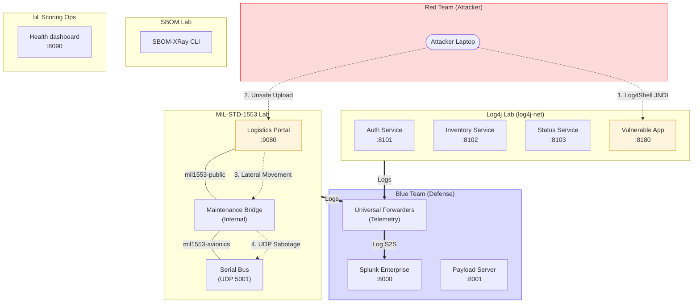
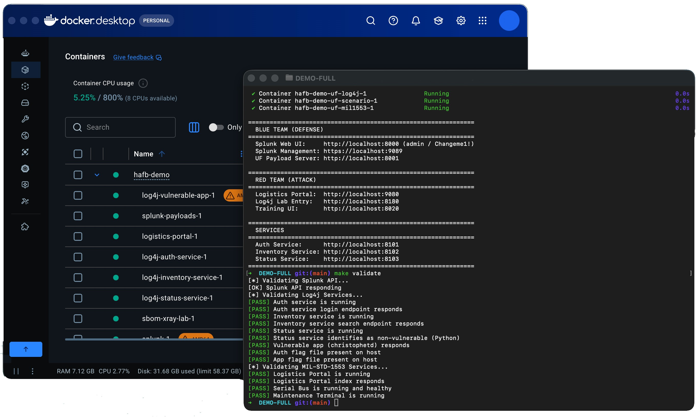

# HAFB Capstone: Red/Blue Team Lab

A comprehensive, monorepo-based lab environment for training on modern vulnerabilities (Log4Shell), supply-chain attacks (MIL-STD-1553), and defensive operations using Splunk.



---

## 1. Setup & Installation

Get the environment running in minutes.

### Prerequisites
*   **Docker** with Compose v2
*   **GNU Make** and **Bash** (WSL2/Git Bash for Windows)

### Step-by-Step Instructions
1.  **Initialize Environment**:
    ```bash
    make setup
    ```
    *This creates your `.env` file and downloads necessary Splunk payloads.*

2.  **Start the Stack**:
    ```bash
    make up
    ```
    *This builds all images and starts the entire environment, including log forwarders.*

3.  **Validate Health**:
    ```bash
    make validate
    ```
    *Wait ~5 minutes for Splunk to initialize. Use `make logs-splunk` if it hangs.*

<p align="center">

</p>

---

## 2. Red Team: Attacks

Explore and exploit intentional vulnerabilities across different domains.

### Attack Path 1: Log4Shell (JNDI Injection)
*   **Target**: Auth Service (:8101) or Inventory Service (:8102).
*   **Method**: Use the embedded RT-Log4j attacker container and training UI to probe the guided services, then compare against the standalone vulnerable app.
*   **Guided UI**: `http://localhost:8020`
*   **Attacker Shell**: `make rt-log4j-shell`
*   **Manual Comparison Target**: `http://localhost:8180`

### Attack Path 2: MIL-STD-1553 Supply Chain
*   **Target**: Internal Avionics Serial Bus.
*   **Method**:
    1.  Upload a poisoned `daily_maintenance.sh` script to the **Logistics Portal** (:9080).
    2.  The **Maintenance Terminal** pulls and executes the script.
    3.  The script sends unauthorized UDP commands to the **Serial Bus**.

> **[IMAGE: Diagram of the MIL-STD-1553 attack chain showing the leap from public to internal network]**

---

## 3. SBOM & Supply Chain Security

Understand how to identify vulnerable components before they are exploited.

1.  **Enter Lab**: `make shell SERVICE=sbom-xray-lab`

2. **Follow the lab materials** in `apps/SBOM-XRay/`:
   - **[Student guide](apps/SBOM-XRay/sbom-xray-lab-student-guide.md)** — context, tooling, and walkthrough
   - **[Student worksheet](apps/SBOM-XRay/sbom-xray-lab-student-worksheet.md)** — exercises and deliverables
> **[IMAGE: Screenshot of a Syft scan result highlighting the Log4j vulnerability]**

---

## 4. Blue Team: Defense & Remediation

Use Splunk to detect attacks and learn how to patch the environment.

### Defensive Operations (Splunk)
*   **Access**: `http://localhost:8000` (User: `admin` / Pass: Check `.env`)
*   **Dashboards**: Open the "Blue Team Summary" dashboard to see failed logins, file uploads, and bus activity.
*   **Field Parsing**: Logs are pre-parsed into fields like `loglevel`, `src_ip`, `method`, and `status_code` for easy searching.

### Lab health & scoring (`hafb-scoring-ops`)
*   **Access**: `http://localhost:8090` — overall score and per-family HTTP checks against the Log4j and MIL-STD-1553 labs.
*   Use **Start** for live probes inside Compose, or **Demo** for deterministic scripted scenarios (good for dry runs without touching victims).

### Fixing the Exploits
*   **Log4j**: Update the `pom.xml` in the service directories to use Log4j 2.17.1+ and rebuild.
*   **MIL-STD-1553**: Implement filename validation and signature checking in `apps/MIL-STD-1553-Vulnerable/src/logistics-portal/app.py`.

> **[IMAGE: Splunk search result showing a detected Log4Shell injection attempt]**

---

## Management Cheat Sheet

| Command | Description |
| :--- | :--- |
| `make help` | Show all available commands |
| `make up` | Start everything (Profile: Forwarders included) |
| `make down` | Stop everything and wipe temporary data |
| `make urls` | Show all service URLs and credentials |
| `make test` | Run automated health and security tests |
| `make logs` | View application logs (excludes Splunk noise) |
| `make shell SERVICE=<name>` | Open a terminal in a specific container |

---
*For training purposes only. Run in isolated lab environments.*
