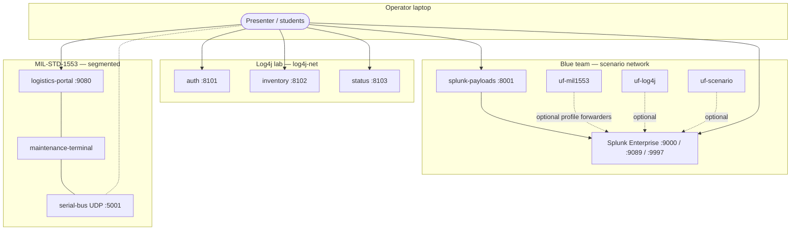
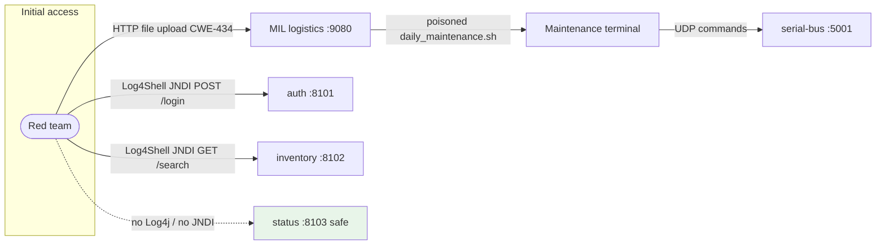

# DEMO-FULL

Monorepo that wires **HAFB capstone apps** into one Docker Compose stack for red-team / blue-team exercises. Everything is started from the **repository root**; per-app folders keep source, lab text, and helper scripts only (no nested Compose files).

## Prerequisites

- [Docker](https://docs.docker.com/get-docker/) with Compose v2 (`docker compose`)
- **GNU Make** and **Bash** (Git Bash or WSL on Windows; native Linux/macOS work out of the box)
- Network access for the **first** `make setup` if Splunk forwarder `.deb` / `.rpm` files are not already in `apps/splunk/deployment/payloads/` (the Splunk app’s `setup_host.sh` downloads them when possible)

## Quick start

```bash
cp .env.example .env          # optional — `make setup` creates root .env if missing
make setup                    # Splunk UF payloads + apps/splunk/.env from template there
# Edit root .env and set SPLUNK_PASSWORD (keep the same value Splunk expects on first boot)
make up                       # builds images and starts containers
make urls                     # print ports
```

Splunk may take **several minutes** the first time. Use `make logs-splunk` or `make validate` once the container is healthy.

## Architecture

High-level view of how services and networks fit together in the **root** [`docker-compose.yaml`](docker-compose.yaml).



- **MIL-STD-1553:** `logistics-portal` and `maintenance-terminal` share `mil1553-public`; `serial-bus` sits on **`mil1553-avionics`**, which is **internal** (no direct route to the internet or Splunk segment).
- **Log4j:** All three APIs share `log4j-net` only with each other on the container network; you reach them via **published** host ports **8101–8103**.
- **Splunk / payloads / optional UFs:** Share `scenario`; published ports reach the host.

## Attack routes (red team)

Typical **training** paths (intentionally vulnerable components only).



**Narrative**

1. **MIL supply-chain:** The portal accepts uploads with unsafe filenames. The bridge host pulls `daily_maintenance.sh` and runs it with access to the **internal** avionics UDP bus—there is **no** direct path from your browser to `serial-bus`; you must cross the bridge.
2. **Log4j:** Auth and inventory log attacker-controlled strings through **Log4j 2.14.1**; status is Python and used as a **negative control**.
3. **Blue team:** Splunk (and optional Universal Forwarders) support detection and timelines; forwarder install flows use **:8001** on the host.

## Demo walkthrough (showcase script)

Use this as a **presenter runbook** (~20–30 minutes with discussion). Adjust order if Splunk is still warming up.

### 1. Housekeeping (2 min)

- Show the repo: one `docker-compose.yaml`, one `Makefile`, apps under `apps/`.
- Run `make urls` and keep the list visible for the room.

### 2. Bring the environment up (3–5 min)

- `make setup` once per machine (or when forwarder payloads are missing).
- `make up`; explain that Splunk is heavy—`make logs-splunk` until login is reachable, then `make validate`.
- Optional: `make forwarders-up` and mention **three** forwarder hostnames in Splunk’s forwarder management / data onboarding story.

### 3. Blue team anchor — Splunk (5 min)

- Open **http://localhost:9000**, sign in with `admin` and `SPLUNK_PASSWORD` from `.env`.
- Show saved content under Search (dashboards/rules mounted from `apps/splunk/analytics/`).
- Mention **http://localhost:8001** for UF packages and `deploy_splunk_forwarder.sh` on Linux targets.

### 4. Enterprise / Log4j storyline (5–8 min)

- Hit **http://localhost:8103** (status) — Python, not vulnerable; contrast with Java services.
- **http://localhost:8101** and **8102** — explain Log4Shell surface (`/login` body vs `/search?q=`). Do **not** run live exploit code against production; in class, use isolated lab only and your approved toolchain.
- Tie to **SBOM** narrative: open [apps/SBOM-XRay/README.md](apps/SBOM-XRay/README.md) and the student guide for “how we would know Log4j is here.”

### 5. OT / air-gap — MIL-STD-1553 (8–12 min)

- Open **http://localhost:9080** — maintenance upload UI.
- Walk the **zones**: NIPRNet portal → bridge → internal bus (see [apps/MIL-STD-1553-Vulnerable/README.md](apps/MIL-STD-1553-Vulnerable/README.md)).
- Optional live punch: upload a benign script or use `tools/attack/attack_payload.sh` renamed to `daily_maintenance.sh`, then `make logs` and filter `maintenance-terminal` / `serial-bus` for ignition / status lines.
- Run `make test-mil1553-chain` before the demo if you want a green CI-style check. It uses an ephemeral Compose **project name** but still binds the **same host ports** as the full stack—run `make down` first, or run the test on a clean runner.

### 6. Wrap-up (2 min)

- `make down` to stop; `make clean` if you need to wipe Splunk volumes next time.
- Point to per-app READMEs for deep exploitation steps and to `make test-log4j` / `make test-mil1553-tools` for quick regression checks.

## What gets started

| Area | Services | Host URLs / ports |
|------|-----------|-------------------|
| Blue team | Splunk Enterprise | Web **http://localhost:9000**, mgmt **https://localhost:9089**, ingest **9997** |
| Blue team | Payload server | **http://localhost:8001** — forwarder installers + `deploy_splunk_forwarder.sh` for **Linux targets** |
| MIL-STD-1553 lab | logistics portal, maintenance terminal, serial bus | Portal **http://localhost:9080**, UDP **5001** |
| Log4j lab | auth, inventory, status | **http://localhost:8101** … **8103** |

Host ports are chosen so **nothing collides** on one machine (Splunk UI is not 8002 because the Log4j inventory service maps there internally).

## Make targets

| Target | Purpose |
|--------|---------|
| `make setup` | Create root `.env` if needed; run `apps/splunk/setup_host.sh` with `SKIP_SERVE=1` |
| `make build` | `docker compose build` |
| `make up` | `docker compose up -d --build` |
| `make down` | Stop stack |
| `make restart` | `down` then `up` |
| `make logs` | Follow all container logs |
| `make logs-splunk` | Splunk container only |
| `make ps` | Container status |
| `make clean` | Stop and **remove volumes** (Splunk data reset) |
| `make forwarders-up` / `make forwarders-down` | Optional UF profile |
| `make validate` | Splunk API check **inside** the `splunk` container |
| `make urls` | Print service URLs |
| `make test-log4j` | HTTP health checks for Log4j lab (ports 8101–8103) |
| `make test-mil1553-chain` | Ephemeral end-to-end MIL attack chain (uses host **9080** / **5001** — stop main stack first if needed) |
| `make test-mil1553-tools` | Ephemeral serial-bus + attacker image tests (uses **5001/udp** — same caveat) |
| `make reset-log4j` | Recreate only Log4j containers |
| `make reset-mil1553` | Recreate only MIL-STD-1553 containers |

## Splunk and Universal Forwarders

### In Docker (optional)

```bash
make forwarders-up
```

Starts three `splunk/universalforwarder` containers that register to Splunk. They demonstrate **forwarder inventory and connectivity**; they do not automatically ingest stdout from other lab containers.

### On real Linux VMs or bare metal

1. Keep **splunk-payloads** reachable on **port 8001**.
2. On each target: `curl -O http://<BLUE_HOST>:8001/deploy_splunk_forwarder.sh` then `sudo bash deploy_splunk_forwarder.sh <BLUE_HOST> <BLUE_HOST>`.
3. Targets must reach Splunk on **9089** and **9997** on the Docker host.

Details: [apps/splunk/README.md](apps/splunk/README.md).

## Repository layout

- **`apps/MIL-STD-1553-Vulnerable/`** — Multi-zone 1553 / logistics scenario ([README](apps/MIL-STD-1553-Vulnerable/README.md)).
- **`apps/Log4j-Vulnerable/`** — Log4Shell lab ([README](apps/Log4j-Vulnerable/README.md)).
- **`apps/splunk/`** — Splunk image, analytics, payloads ([README](apps/splunk/README.md)).
- **`apps/SBOM-XRay/`** — Offline SBOM lab ([README](apps/SBOM-XRay/README.md)); not part of Compose.

## Troubleshooting

- **Splunk never becomes healthy**: More Docker memory/CPU; `make logs-splunk`. First boot can exceed five minutes.
- **`make validate` fails**: Wait for healthcheck; align `SPLUNK_PASSWORD` in root `.env` with first-time provisioning (`make clean` + `make up` resets persisted state).
- **Port already allocated**: Edit host mappings in [docker-compose.yaml](docker-compose.yaml).
- **Windows**: Prefer WSL2 + Docker Desktop and Git Bash for `make` / shell scripts.

## GitHub and large files

GitHub rejects blobs over **100 MB**. Large `.tar` artifacts under `apps/SBOM-XRay/artifacts/` should use [Git LFS](https://git-lfs.github.com/) or external hosting.
