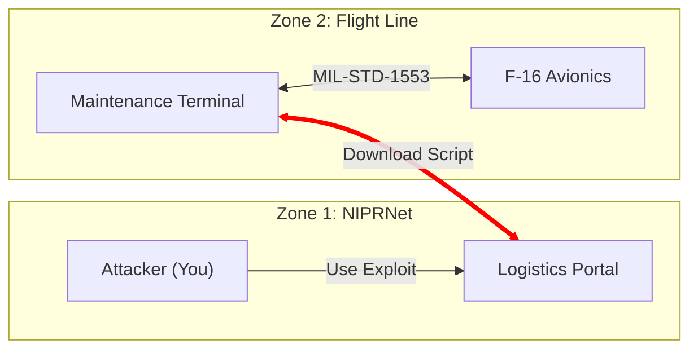

# ⚔️ OPERATION: SKY SHIELD (VULN-MIL-STD-1553)

## Mission Briefing
**Objective:** Penetrate the Air Force maintenance network, jump the air-gap, and sabotage the F-16 Engine Controller.

You are a member of a Red Team tasked with auditing the security of the Air Force's "Air-Gapped" maintenance systems. Intelligence indicates that the flight line uses a ruggedized **Maintenance Terminal** (Panasonic Toughbook) to sync flight logs to the NIPRNet (Logistics Network).

This terminal acts as a bridge. It connects to the Logistics Portal to download "daily maintenance scripts," and then connects to the jet's internal MIL-STD-1553 bus to execute them.

## Architecture
The environment simulates a realistic segmented military network:

1.  **Zone 1: NIPRNet (The Office)**
    *   **Service:** `logistics-portal` (web)
    *   **IP:** Exposed on `localhost:80`
    *   **Role:** Central repository for maintenance scripts and logs.
    *   **Vulnerability:** Unrestricted File Upload.

2.  **Zone 2: The Bridge (Maintenance Terminal)**
    *   **Service:** `maintenance-terminal`
    *   **Access:** Hidden (No direct user access).
    *   **Role:** The Crew Chief's laptop.
    *   **Behavior Check:** Every 10 seconds, it downloads `daily_maintenance.sh` from the Logistics Portal and executes it.
    *   **Capabilities:** It is the *only* device connected to the Jet.

3.  **Zone 3: The Jet (F-16 Avionics)**
    *   **Service:** `serial-bus` (udp/5001)
    *   **Network:** `avionics-net` (Air-Gapped / Internal Only).
    *   **Role:** F-16 Engine Controller.
    *   **Protocol:** MIL-STD-1553 (Simulated over UDP).

### Network Diagram


## Deployment
```bash
# 1. Start the exercise
make up

# 2. Reset the environment (if you break it)
make reset

# 3. View logs (to see if you triggered the engine)
make logs

# 4. Run automated tests (verify the kill chain)
make test
```

## Classified: Exploitation Guide (Red Team Eyes Only)

### Phase 1: Initial Access
1.  **Reconnaissance**
    *   **Target**: `http://localhost:80` (Logistics Portal)
    *   **Action**: Observe the "Maintenance Log Upload" form.
    *   **The Flaw**: The application takes the filename provided by the user and saves it directly to the local filesystem without sanitizing the path.

### Phase 2: The Supply Chain Attack
The F-16 is air-gapped. You cannot reach it directly. You must trick the **Maintenance Terminal** into running your code.

1.  **The Mechanism**: The `maintenance-terminal` container runs a script that constantly tries to download `http://logistics-portal:8080/uploads/daily_maintenance.sh`.
2.  **The Exploit**:
    *   Create a file locally named `attack.sh`, or use the premade payload in `tools/attack/attack_payload.sh`.
    *   **Payload**: The script needs to send the "Engine Start" command to `serial-bus` on UDP port 5001.
        ```bash
        #!/bin/bash
        # Target the internal hostname 'serial-bus' because the Terminal can see it!
        echo -e "\x01" > /dev/udp/serial-bus/5001
        echo "IGNITION COMMAND SENT"
        ```
    *   **Upload**: Use the file upload vulnerability on the portal to upload this file, but rename it to `daily_maintenance.sh` so the terminal thinks it's the official work order.

### Phase 3: Effects
1.  **Execution**: Wait ~10 seconds. The terminal will fetch your script.
2.  **Verification**: Run `make logs`. You should see:
    ```text
    [maintenance-terminal] [!] New maintenance order received via NIPRNet!
    [maintenance-terminal] [*] Executing maintenance routine...
    [serial-bus] [STATUS] Engine: IGNITION / STARTING | RPM: 15000 | Temp: 650C
    ```

## 📂 Repository Structure
| Directory | Purpose |
| :--- | :--- |
| `src/logistics-portal` | Python Flask Web App (The Vulnerable Entry Point). |
| `src/maintenance-terminal` | The Bridge (Simulated Laptop). |
| `src/serial-bus` | Python UDP Server (The Hardware Simulator). |
| `tools/attack` | Attacker toolkit (Red Team scripts & payload). |
| `tools/test` | Automated verification scripts. |
| `Makefile` | Admin control scripts. |

## Credits
Please visit [this repository](https://github.com/ShubhankarKulkarni/MIL-STD-1553-Simulator) for the serial bus emulator source code.
