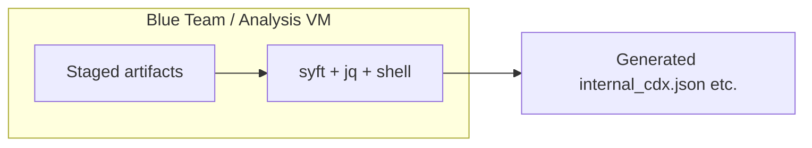

# SBOM X-Ray Lab (Module 1) — Implementation Plan

_Date: 2026-03-20_

## Links

| Artifact | Path |
|----------|------|
| **PRD (scope & acceptance)** | [`sbom-xray-lab-Module1-PRD.md`](./sbom-xray-lab-Module1-PRD.md) |
| **Roadmap (phased checklist)** | `ai/roadmaps/2026-03-20_sbom-xray-lab-Module1_roadmap.md` (gitignored working copy; see `ai/roadmaps/README.md`) |
| **Project context** | [`../PROJECT-CONTEXT.md`](../PROJECT-CONTEXT.md) |
| **Student guide** | [`../sbom-xray-lab-student-guide.md`](../sbom-xray-lab-student-guide.md) |
| **Agent brief** | [`../sbom-xray-lab-agent-brief.md`](../sbom-xray-lab-agent-brief.md) |
| **JARVIS process** | [`../JARVIS-ACCOUNTABILITY.md`](../JARVIS-ACCOUNTABILITY.md) |
| **Repo context** | [`../aiDocs/context.md`](../aiDocs/context.md) |

---

## 1. Thinking: From PRD to Deliverables

The PRD defines **offline SBOM literacy**: generate CycloneDX from image tar, navigate JSON with `jq`, compare to a vendor SPDX file, intersect PURLs across two apps, and critique quality using minimum-elements thinking—including **three concrete vendor deficiencies** and **explicit “known unknown”** markers (e.g. `NOASSERTION`).

**What is not code-heavy:** This module is primarily **curriculum + staged artifacts + VM/tool pinning**. Success is measured by whether a student on an air-gapped analysis VM can run the documented commands and meet every acceptance criterion in the PRD.

**Main risks to design against:** Syft/CycloneDX output shape drift, SPDX that is too broken or too perfect, and student overwhelm from large SBOMs. Mitigations: **pin tool versions** in the image build, **validate every documented `jq` path** against real outputs, and **scaffold** with a short “must-find” field list and time-boxed scavenger hunt.

---

## 2. Architecture (Logical, Not Services)

- **Inputs (static):** `flight-path-v1.tar`, `radar-control-v1.tar` (required for shared-PURL objective), `vendor_claim.spdx.json`, minimum-elements checklist (PDF or Markdown), student guide.
- **Processing:** CLI only—no databases, no web UI for Module 1.
- **Outputs (student-produced):** `internal_cdx.json`, `radar_cdx.json`, intermediate text files (`*-purls.sorted.txt`, `shared-purls.txt`), worksheet answers, short ISSO-facing critique memo.

---

## 3. Key Design Decisions

| Decision | Choice | Rationale |
|----------|--------|-----------|
| Canonical internal format | CycloneDX JSON from Syft | Matches PRD and student guide; Syft is air-gap friendly as a binary. |
| Vendor format | SPDX JSON | PRD requires side-by-side format literacy. |
| Cross-app correlation | PURL intersection via `sort` + `comm` | PRD-mandated minimal toolchain; teaches stable identifiers. |
| Second application | Non-optional for delivery | PRD §7.F requires two apps; student guide already assumes `radar-control-v1.tar`. |
| Vendor SBOM quality | Structurally valid, intentionally incomplete | Agent brief: gaps aligned with CISA minimum elements—not invalid JSON. |
| Documentation split | Student guide + instructor packet | PRD §7.H requires scavenger hunt + rubric; answer key may trail but must be planned. |

---

## 4. Data Flows and Interfaces

1. **Image → CycloneDX:** `syft <image>.tar -o cyclonedx-json > <name>_cdx.json`
2. **CycloneDX navigation:** `jq` against `.metadata`, `.components[]`, `.dependencies[]` (exact selectors validated per pinned Syft version).
3. **CycloneDX vs SPDX:** Compare counts (`components` vs `packages`), creator/supplier fields, hash presence, relationship completeness.
4. **Shared components:** `jq -r '.components[].purl'` → sorted lists → `comm -12` (handle null/absent PURLs in facilitator notes).
5. **Quality critique:** Map both SBOMs to checklist rows; vendor memo must cite ≥3 deficiencies and ≥1 explicit unknown marker.

---

## 5. Artifact Production Strategy

### 5.1 Container images

- Build **two** small but non-trivial images (e.g. Java/Node + shared base packages) so dependency graphs and **shared libraries** are realistic.
- Export with `docker save` → versioned `.tar` files; document checksums for instructor verification.
- No secrets; no proprietary code.

### 5.2 `vendor_claim.spdx.json`

- Describe the **same** logical product as `flight-path-v1.tar`.
- Embed intentional gaps: e.g. missing hashes on key packages, thin `creationInfo`, incomplete `relationships`, `NOASSERTION` (or SPDX-equivalent) where appropriate.
- Validate with a SPDX JSON linter **once** at authoring time (not required at runtime in the lab).

### 5.3 Checklist

- Ship `SBOM_Minimum_Elements.md` (or approved PDF) **on disk** with the lab; keep it short and checklist-oriented.

### 5.4 Layout on VM

- Prefer a single lab root, e.g. `~/labs/sbom-xray/`, matching the student guide; Ansible/playbooks should copy artifacts to that tree.

---

## 6. Security, Safety, and Compliance Posture

- Training-only content; isolated lab VMs (per `PROJECT-CONTEXT.md`).
- No outbound calls; no registry pulls during the lab.
- SBOMs and images are **sanitized** teaching artifacts.

---

## 7. Testing and Validation Approach

| Layer | What to verify |
|-------|----------------|
| **Authoring** | Run full student guide on a clean VM with **pinned** Syft/jq; fix every broken `jq` example. |
| **Acceptance** | Walk PRD §7.A–H as a checklist; capture evidence (screenshots or script transcripts) for instructor runbook. |
| **Regression** | When bumping Syft, re-run metadata/component/dependency spot checks and update docs. |

There may be no application unit tests in this repo; **validation is scenario QA**, not `pytest`.

---

## 8. Sequencing and Dependencies

1. **Freeze toolchain versions** (Syft, jq) and document them in instructor materials.
2. **Build and freeze images + vendor SPDX** (artifacts drive all narrative).
3. **Align student guide** with actual JSON paths and filenames (resolve any path drift vs repo layout).
4. **Add instructor packet**: timing, rubric, answer key, facilitator troubleshooting (optional PURL-null handling).
5. **Package for deployment** (Ansible/copy into `~/labs/sbom-xray/` or `training/scenarios/sbom-xray-lab/` per org conventions).
6. **Pilot** with one dry run; update docs from feedback.

---

## 9. Out of Scope Reminder (Module 1)

Per PRD: live vuln feeds, remediation workflows, heavy UI, provenance/VEX/SLSA, classified platform fidelity—defer to later modules while **preserving PURL and format literacy** this module establishes.
