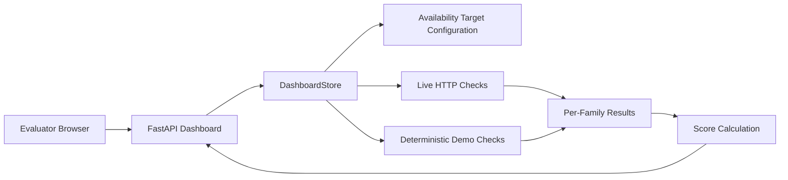

# Architecture Overview

## Purpose

`hafb-scoring-ops` provides an internal health and scoring dashboard for services monitored from the `controlOps` VM. The application is designed for a lab environment where evaluators need a clear, low-friction view of service availability and vulnerability-family health.

## System Model

The current design uses a small backend monitor loop and a configuration-driven target list.

## Core Components

- `app/main.py`
  - exposes the dashboard page and the JSON endpoints
  - provides monitor control routes: start, demo, and stop
- `app/state.py`
  - maintains the in-memory application state
  - owns the monitor lifecycle and timer state
  - stores the current per-family results and overall score
- `app/services/availability.py`
  - executes live HTTP probes
  - provides deterministic demo responses for presentation and verification
- `config/availability_targets.json`
  - defines the monitored vulnerability families and their endpoints
- `static/` and `templates/`
  - render the operator interface

## Scoring Logic

Scoring is based on endpoint availability.

- A check is healthy only when it returns HTTP `200`.
- Each vulnerability family receives a score from `0` to `100`.
- The dashboard score is the arithmetic mean of all family scores.

This model is intentionally transparent so that evaluators can understand how the displayed score was produced.

## Monitoring Modes

The backend supports two monitoring modes.

- Live mode
  - probes the configured internal endpoints from `controlOps`
  - intended for the operational lab environment
- Demo mode
  - returns deterministic results without requiring target services to be running
  - intended for presentation, verification, and offline testing

Both modes use the same dashboard view and the same scoring path.

## Extensibility

The dashboard is designed to scale by configuration rather than by template changes.

- Adding a new endpoint requires only an update to `config/availability_targets.json`.
- Adding a new vulnerability family also requires only a configuration update.
- The frontend renders the configured family and check data automatically.

The current implementation supports HTTP `GET` checks. Non-HTTP services should be represented by an internal health endpoint or a small internal adapter that exposes status over HTTP.

## Deployment Model

The intended deployment model is:

- dashboard service runs on `controlOps`
- monitored endpoints remain internal to the lab
- the browser accesses only the dashboard service
- the dashboard performs checks only against internal lab addresses

Once Python dependencies are pre-staged, the application can run without internet access.
