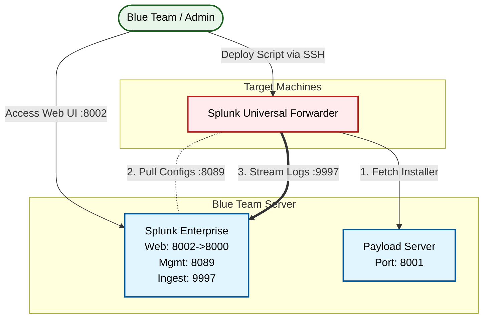

# 🛡️ BT-Splunk (Blue Team Resources)

This repository contains the configuration and deployment scripts for a containerized **Splunk Enterprise** environment, tailored for Blue Team operations in air-gapped or restricted networks. It uses a "Host-to-Target" deployment model where the Blue Team Host serves installers to target machines.

## 🏗️ Infrastructure Diagram



## 🚀 Getting Started

### 1. Host Setup (Run Once)
The **Blue Team Host** (your machine) manages the Splunk server and serves payloads to targets.

1.  Run the setup script:
    ```bash
    make setup
    ```
    *   This will create your `.env` configuration file.
    *   It will automatically download the **Splunk Universal Forwarder** packages (e.g., `splunkforwarder-<VERSION>-linux-amd64.deb` and `splunkforwarder-<VERSION>-x86_64.rpm`) if missing based on your `.env` configuration.
    *   It will start a local **Payload Server** on port `8001`.

2.  Start Splunk Enterprise:
    ```bash
    make up
    ```
    *   Access Splunk at `http://localhost:8002`.
    *   Credentials are set in your `.env` file.

### 2. Deploy to Targets
To monitor a target machine, run the deployment script **on the target machine**.

1.  SSH into your target machine.
2.  Download and run the installer from your Host:
    ```bash
    # Replace <HOST_IP> with your Blue Team Host's IP address
    curl -O http://<HOST_IP>:8001/deploy_splunk_forwarder.sh
    sudo bash deploy_splunk_forwarder.sh <HOST_IP> <SPLUNK_IP>
    ```
    *The script will automatically detect the target OS, dynamically read the target version from `http://<HOST_IP>:8001/payloads/version.txt`, download the payload directly from the local server, install it, and properly configure log forwarding.*

## 📂 Repository Structure

### Root Files
- **`docker-compose.yml`**: Defines the Docker services, volumes, and networks. Brings up the Splunk container on the Blue Team host.
- **`Makefile`**: Contains simplified commands to build, start, stop, and clean up the Docker environment.
- **`setup_host.sh`**: Prepares the host machine with necessary directories and permissions prior to starting containers.

### `config/`
Contains the files necessary to build the Splunk container image.
- **`Dockerfile`**: Defines the custom Splunk image, copying in local configurations and setting permissions.
- **`ansible.cfg`**: Configures Ansible behaviors used within the Splunk container startup process (to suppress privilege escalation warnings).

### `deployment/`
Contains scripts and payloads for deploying the Splunk Universal Forwarder to target machines over the local network.
- **`serve.py`**: A simple Python HTTP server that hosts the contents of the `deployment/` directory on port `8001`. This allows target machines to download the forwarder without internet access.
- **`deploy_splunk_forwarder.sh`**: A shell script meant to be run on target machines. It detects the OS, dynamically downloads the appropriate forwarder package from the local `serve.py` payload server, installs it, and configures it to forward logs back.
- **`payloads/`**: Directory where the actual Splunk Universal Forwarder packages (e.g., `splunkforwarder-<VERSION>-linux-amd64.deb` and `splunkforwarder-<VERSION>-x86_64.rpm`) are stored to be served by `serve.py`. The `version.txt` file is also created here by `setup_host.sh` during initialization so target deployments know what to fetch.

### `analytics/`
Contains custom rules, dashboards, and input configurations for Splunk to parse and alert on incoming log data.
- **`rules/`**: Custom alert rules and saved searches.
- **`dashboards/`**: Pre-configured Splunk dashboards in XML format (e.g., `blue_team_summary.xml`). These are automatically loaded into Splunk's `Search` app via a volume mount in `docker-compose.yml`.
- **`inputs.conf.example`**: Example template for configuring log inputs.

### `validation/`
- Scripts or tools used to validate the operational status of the deployment (e.g., checking Splunk API health).

## 🛠️ Commands

| Command | Description |
| :--- | :--- |
| `make setup` | Setup host environment, fetch payloads, start payload server. |
| `make up` | Start Splunk. |
| `make down` | Stop Splunk. |
| `make logs` | View container logs. |
| `make test` | **Automated Validation:** Checks Splunk API health. |
